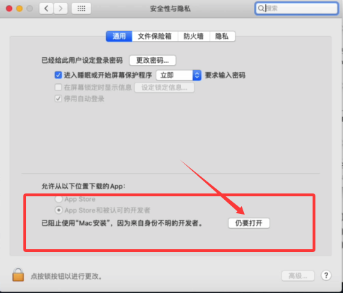

# Zotero-WPSJS

#### 介绍

zotero-wpsjs文字加载项，一款 学术论文管理 和 wps文字 交互插件

支持平台:Windows & Linux & Mac

#### 软件架构

wpsjs 加载项和 python
	
#### 使用说明

本插件需要用户的授权才能正常使用

最低兼容版本

Mac端 Wps6.15   Zotero 7.x

Zotero相关使用教程https://zotero-chinese.com/user-guide/
#### 安装教程

视频教程 B站 【Zotero for wps加载项-哔哩哔哩】 https://b23.tv/umvN65m

Windows平台

  wps相关设置---

   1.工具--->宏安全性--->可靠发行商--->勾选 '信任对于wpsjs项目的访问'

   2.全局设置--->设置--->关闭 '沙箱保护'

   安装---

   3.运行项目文件夹内的  安装.exe

Linux平台

  wps相关设置---

   1.工具--->宏安全性--->可靠发行商--->勾选 '信任对于wpsjs项目的访问'

   权限设置---

   2.请对项目文件夹内的 runPY.sh 添加执行权限

   安装---

   3.执行项目文件夹内的 install.py

   Mac平台

  wps相关设置---

   1.工具--->宏安全性--->可靠发行商--->勾选 '信任对于wpsjs项目的访问'

   安装---
   
   2.打开项目文件夹内的 Mac安装

   如果有提示弹窗，请允许，打开或确认。如果没提示，请前往 安全与隐私 里点击仍要打开 如图

#### 致谢 
  由于2024年左右，wps官方进行了加载项的代码审查，导致部分接口下线，同年6月，因zotero qq交流群1029775161的群主bigben446求助，得以认识此项目，经过修修补补，于12月27日完成Mac端的适配工作。
  感谢github：tankwyn Ooo、l0o0两位作者前期所付出巨大努力，此项目 (https://github.com/tankwyn/WPS-Zotero) 方能和用户见面，感谢wps官方的倾力支持，感谢qq DreamtimeUnderStars 网友提供的文字安装教程，感谢qq akihi. 网友的视频教程，感谢所有为此项目努力和使用的人！！

#### 与我联系

你有任何建议或意见 可以通过以下方式联系我

qq:897081475

qq群:1029775161

